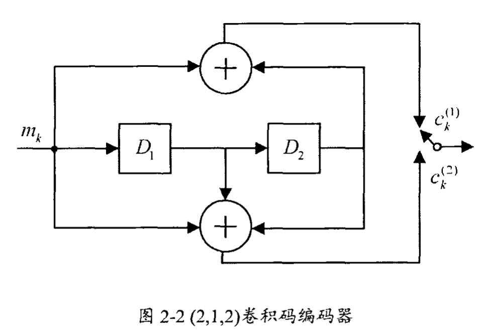
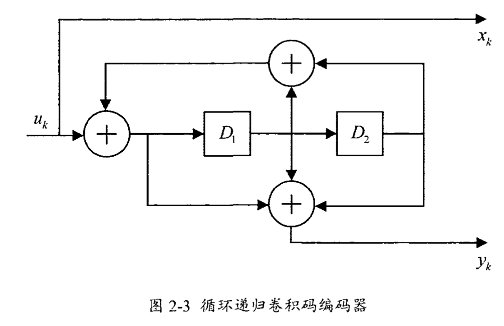

# Turbo码盲识别

递归卷积码是Turbo码的基础，Turbo码的盲识别涉及**编码器结构**到**交织器参数**以及**删余模式**等方面。

## 一、Turbo码结构

在了解Turbo码之前，首先要理解卷积码的概念，一般卷积码的生成矩阵为：
$$
G(D)=[g_1(D)\quad g_2(D)]=[1+D^2\quad 1+D+D^2]
$$
其编码器框图如下：

Turbo的基本构成是递归系统卷积码，递归系统卷积码的生成矩阵为：
$$
G(D)=\begin{bmatrix}1&\frac{g_2(D)}{g_1(D)}\end{bmatrix}=\begin{bmatrix}1&\frac{1+D^2}{1+D+D^2}\end{bmatrix}
$$
其中，$g_1(D)$为反馈多项式，$g_2(D)$为前馈多项式。递归系统卷积码编码器如下：

